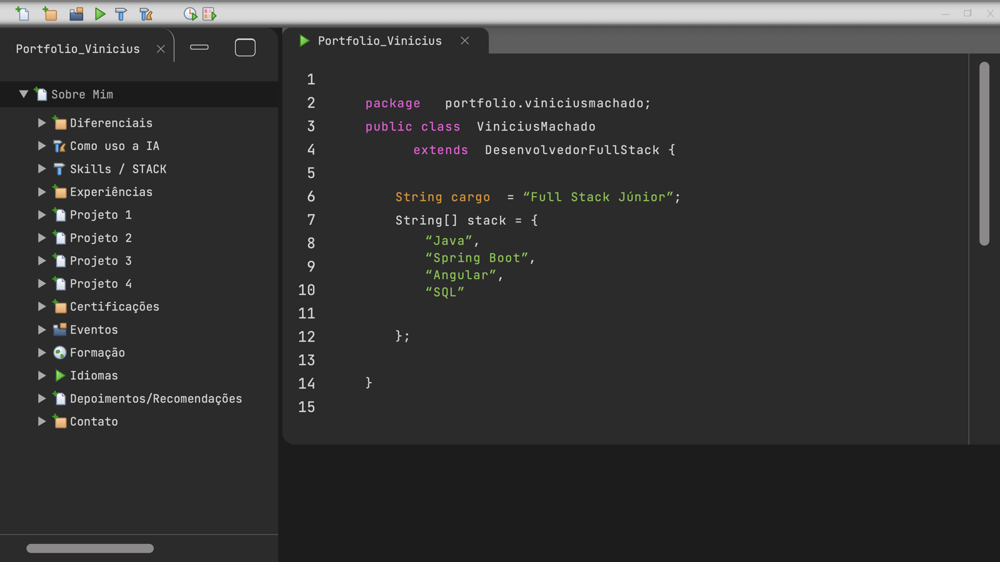
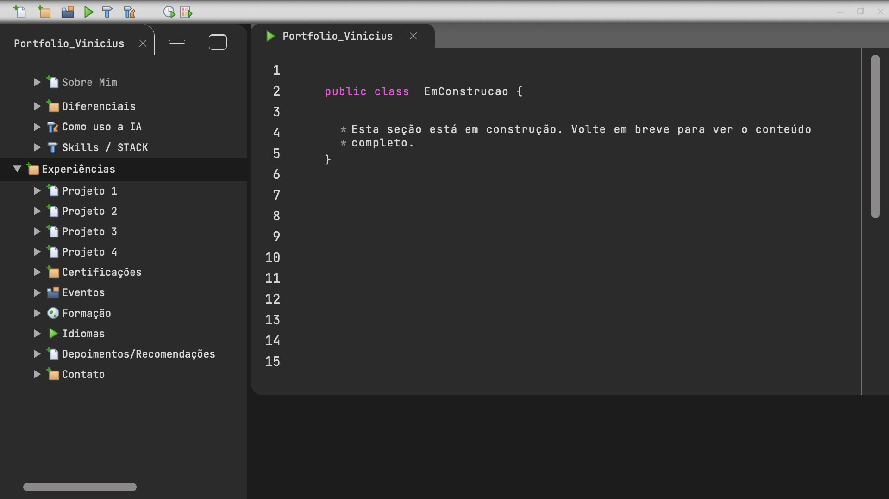
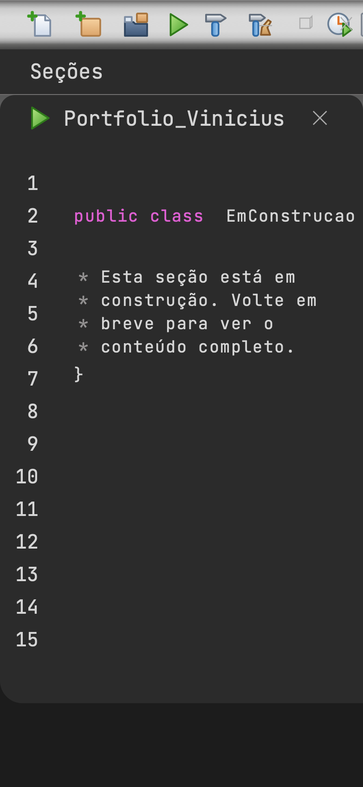
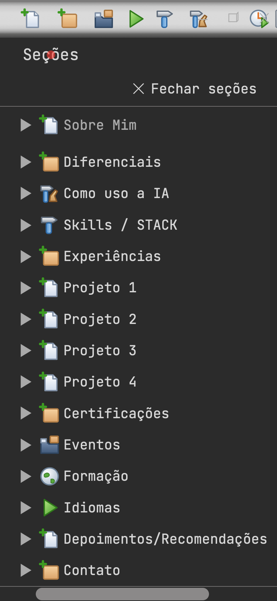

# 0002: Fundação visual e casca da IDE

- **Data:** 2026-10-09
- **Change:** [fundacao-visual-e-casca-da-ide](../../openspec/changes/archive/2026-10-09-fundacao-visual-e-casca-da-ide/)
- **PR:** [#12](https://github.com/viniassuncao1/Portifolio-Vinicius-Machado/pull/12)
- **ADRs:** [0008](../adr/0008-diario-de-desenvolvimento.md) e
  [0009](../adr/0009-acessibilidade-automatizada-com-axe.md)

## Problema

O site ainda era um título com "Em construção". O design tem 30 telas e, antes de implementar
qualquer uma, eu precisava saber o que se repete entre elas. Se cada seção virasse um componente
com layout próprio, eu escreveria a mesma IDE 15 vezes e qualquer ajuste visual teria de ser
feito em todas. A change também precisava deixar o processo registrado, para virar conteúdo desde
o começo.

## Decisões

- **Uma casca só, como rota-pai.** O inventário das 30 telas mostrou que todas têm o mesmo
  esqueleto: barra de ferramentas, árvore de seções, aba e editor. Só muda o conteúdo do editor e
  o item selecionado. A casca é montada uma vez e as 15 seções (mais o Início) são rotas filhas
  pré-renderizadas, então a transição de rota anima só o conteúdo. Descartei incluir a casca no
  template de cada feature: duplicaria a estrutura e quebraria a regra de que uma feature não
  importa outra.
- **Conteúdo como dados tipados.** Um único `EditorDeCodigo` desenha o "Java" de todas as seções a
  partir de linhas e trechos tipados, com funções construtoras curtas. Uma seção nova é um
  arquivo de dados, sem componente de editor novo. Descartei escrever Java como texto e colorir
  com uma biblioteca de realce de sintaxe: as cores do design não seguem um tema padrão, a
  biblioteca pesaria no bundle e o design usa "pseudo-Java" que um parser marcaria como erro.
- **Design tokens extraídos das telas.** Cores, tipografia, medidas e movimento viram variáveis
  CSS, e os componentes usam só tokens. A fonte JetBrains Mono é servida pelo próprio site, sem
  Google Fonts.
- **Acessibilidade verificada por máquina.** O axe roda nos E2E em todas as rotas, e qualquer
  violação reprova o PR. ADR [0009](../adr/0009-acessibilidade-automatizada-com-axe.md).
- **Gaveta no celular.** O design só tem telas de desktop. Abaixo de 768px o painel lateral vira
  uma gaveta aberta pelo botão "Seções". Essa decisão foi nossa, mantendo cores e fontes do
  design.
- **Fidelidade acima da semântica completa no Início.** Na tela 01, "Sobre Mim" aparece
  destacado na árvore. O Vinicius decidiu seguir o design: o item fica destacado, mas sem
  `aria-current`, porque o Início não é aquela seção.

## Aprendizado

- **O tamanho das telas enganou.** Os PNGs do design tinham 1600x900, exportados do PDF original
  de 1920x1080. As medidas saíram multiplicadas por 1,2. O espaçamento entre letras foi medido
  nos pixels: o avanço é de 15,3px por caractere a 1920. Medir antes de chutar evitou um ajuste
  "a olho" em cada componente.
- **Três cores do design não passavam no contraste WCAG AA.** A palavra-chave tinha 2,82:1, a
  anotação 3,98:1 e o marcador do comentário 4,07:1. Clareei as três mantendo o tom e anotei o
  ajuste na note "Design Tokens". Fidelidade ao design tem limite quando o contraste fica
  abaixo do mínimo.
- **Um bug visual que os testes não pegariam.** A coluna de números de linha definia a altura do
  editor (4455px). Só apareceu na revisão visual, comparando o resultado com a tela de
  referência.
- **O axe achou o que eu não vi.** No celular, a área de código rolável não tinha foco por teclado
  (regra `scrollable-region-focusable`), nas 16 rotas. A correção foi `tabindex`,
  `role="region"` e `aria-label`.
- **O servidor dos E2E escondia erros.** O `serve --single` entregava a página inicial em todas as
  rotas, então um erro de pré-renderização numa seção passaria despercebido. A Sentinela criou um
  servidor estático que imita a Vercel (`e2e/servidor.mjs`). Remover o `serve` também zerou as
  vulnerabilidades do `npm audit`.
- **Bastidores da equipe de agentes.** O Mac dormindo, com a tampa fechada, interrompeu os
  agentes várias vezes. O Regente passou a pedir commits a cada parte, para não perder trabalho.
  Os agentes rodam na pasta do próprio papel e precisaram de permissão para ler o projeto.

## Links

- Change: [`openspec/changes/archive/2026-10-09-fundacao-visual-e-casca-da-ide`](../../openspec/changes/archive/2026-10-09-fundacao-visual-e-casca-da-ide/)
- ADRs: [0008 diário de desenvolvimento](../adr/0008-diario-de-desenvolvimento.md) e
  [0009 acessibilidade com axe](../adr/0009-acessibilidade-automatizada-com-axe.md)
- Documentação: [componentes](../componentes.md) e [arquitetura](../arquitetura.md)
- Entrada anterior: [0001 fundação do projeto](0001-fundacao-do-projeto.md)

## Rascunho de post para o LinkedIn

> Meu portfólio tem 30 telas de design, mas só um layout.
>
> Antes de escrever código, fiz um inventário das telas e vi que todas repetem o mesmo esqueleto
> de IDE: barra de ferramentas, árvore de seções, aba e editor. Só o conteúdo muda. Então o
> conteúdo virou dados tipados, e um único componente desenha o "Java" de todas as seções.
>
> No caminho, o processo me ensinou algumas coisas:
>
> - Os PNGs do design tinham 1600x900, exportados de um PDF de 1920x1080. Tive de multiplicar as
>   medidas por 1,2 para acertar tamanhos e espaçamentos.
> - Três cores de sintaxe do design não passavam no contraste WCAG AA. Clareei as três sem mudar o
>   tom.
> - O teste de acessibilidade automático (axe) achou uma área de código rolável sem foco por
>   teclado no celular, em todas as rotas. Eu não tinha visto.
> - O servidor dos testes E2E entregava a página inicial em qualquer rota. Trocamos por um que
>   imita a Vercel, e um erro assim não passa mais despercebido.
>
> Tudo isso com uma equipe de agentes de IA, cada um no seu papel, e com cada decisão registrada
> num ADR.
>
> Você mede o design antes de implementar ou ajusta a olho? Como lida com cores que não passam
> no contraste?
>
> #Angular #Acessibilidade #IA
