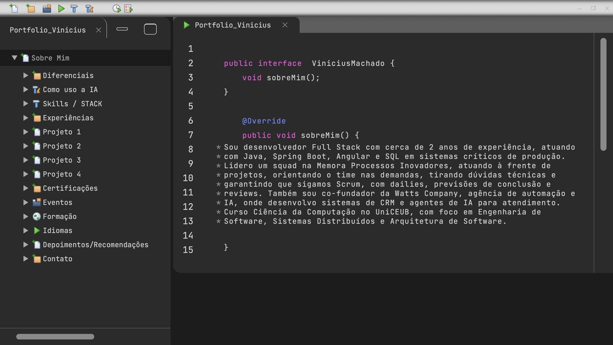
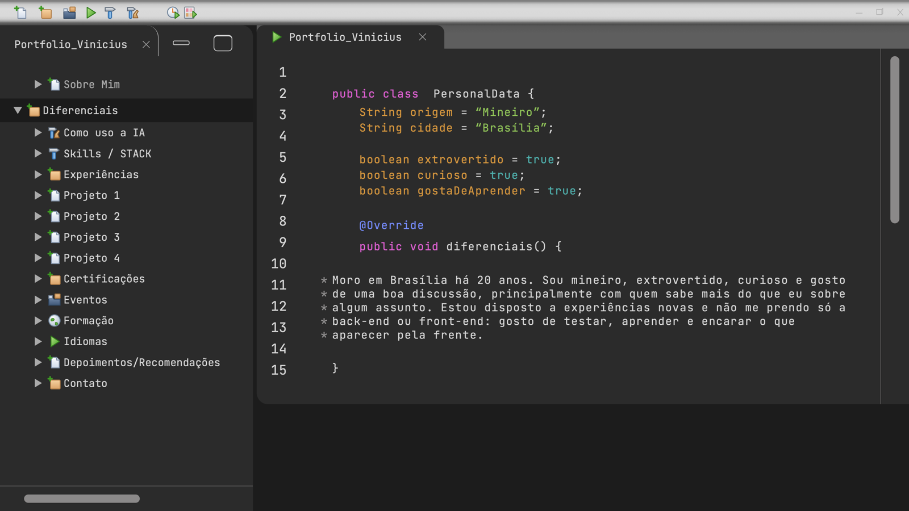

# 0003: Seções Sobre Mim e Diferenciais

- **Data:** 2026-10-09
- **Change:** [secoes-sobre-mim-e-diferenciais](../../openspec/changes/archive/2026-10-09-secoes-sobre-mim-e-diferenciais/)
- **PR:** [#14](https://github.com/viniassuncao1/Portifolio-Vinicius-Machado/pull/14)
- **ADRs:** nenhum (a change não tomou decisão nova de arquitetura, ferramenta ou processo)

## Problema

As rotas `/sobre-mim` e `/diferenciais` ainda mostravam o aviso de "em construção". São as duas
primeiras seções da árvore e as que apresentam o Vinicius, então são as primeiras que um
recrutador abre. Também era o primeiro teste da aposta da fundação: com a casca e o editor
prontos, uma seção nova deveria ser só conteúdo.

## Decisões

- **Cada seção é um arquivo de dados.** Sobre Mim (tela 02) e Diferenciais (tela 03) ganharam uma
  pasta em `features/` com o conteúdo tipado, um componente de poucas linhas e o teste. Nenhum
  componente de editor, estilo ou item de árvore novo.
- **Um papel de sintaxe novo para valores literais.** A tela 03 tem o `true` dos `boolean` num
  verde-azulado (`#4fafac`), diferente do verde dos textos. O editor não tinha esse elemento, então
  ganhou o papel `valor`, a construtora `valor()` e o token `--cor-sintaxe-valor`. O contraste é de
  5,43:1, então a cor ficou como no design, sem ajuste.
- **O editor passou a imitar o design onde ele é preciso.** Medindo as telas, o parágrafo do
  design quebra em 72 colunas, e o editor passou a quebrar igual, por um token
  (`--colunas-paragrafo`). A tela 03 também tem linhas vazias mais baixas entre os grupos de
  campos, que viraram `vaziaCompacta()`.
- **Fidelidade, mesmo quando não é Java válido.** O código reproduz o design como está. A classe
  da tela 03, por exemplo, não fecha a chave. Não corrigi: o design é a referência, e o conteúdo
  é para ser lido como a identidade visual de uma IDE, e não para compilar.
- **Um mapa de slug para feature.** Cada seção que ganha conteúdo foi trocando uma rota escrita à
  mão, até que a segunda seção deixou claro o padrão. Fica um mapa `FEATURES_DAS_SECOES` em
  `app.routes.ts` e as rotas saem todas de `SECOES`: seção nova é uma linha no mapa.

## Aprendizado

- **A aposta da fundação se confirmou.** A primeira seção depois da fundação levou só dados. O
  desenho de "seção = arquivo de conteúdo" funcionou sem mexer na casca, e o que sobrou de
  trabalho foi justamente o que o editor ainda não sabia fazer.
- **Medir as telas continua rendendo.** Foi medindo que apareceram o `true` com cor própria, as
  72 colunas do parágrafo e as linhas vazias mais baixas. Olhar "mais ou menos igual" deixaria
  tudo isso passar.
- **Refatorar na hora certa.** Com uma seção, trocar a rota à mão era simples. Com duas, o padrão
  apareceu, e o mapa `FEATURES_DAS_SECOES` deixou cada seção seguinte em uma linha.
- **A qualidade acompanhou.** A change fecha com 172 testes unitários e 101 E2E passando, e o axe
  sem violações nas 16 rotas.

## Links

- Change: [`openspec/changes/archive/2026-10-09-secoes-sobre-mim-e-diferenciais`](../../openspec/changes/archive/2026-10-09-secoes-sobre-mim-e-diferenciais/)
- Documentação: [componentes](../componentes.md), com o papel `valor` e as duas seções como
  exemplo de "como criar uma seção só com dados"
- Entrada anterior: [0002 fundação visual e casca da IDE](0002-fundacao-visual-e-casca-da-ide.md)

## Rascunho de post para o LinkedIn

> A primeira seção do meu portfólio depois da fundação levou só dados.
>
> Na fundação, apostei que toda seção seria "um arquivo de conteúdo" desenhado por um único
> editor de código. Agora testei: Sobre Mim e Diferenciais entraram sem mexer na casca da IDE.
>
> O trabalho que sobrou foi o que o editor ainda não sabia fazer, e só apareceu porque medi as
> telas do design:
>
> - o `true` dos boolean tem uma cor própria, um verde-azulado diferente do verde dos textos
>   (contraste de 5,43:1, então ficou como no design);
> - o parágrafo do design quebra em 72 colunas, e o editor passou a quebrar igual;
> - as linhas vazias entre os grupos de campos são mais baixas que as normais.
>
> Mantive até o que não é Java válido: a classe da tela 03 não fecha a chave, porque o design é a
> referência.
>
> Depois da segunda seção o padrão ficou claro, e as rotas viraram um mapa de seção para feature.
> A próxima seção é uma linha.
>
> A change fechou com 172 testes unitários, 101 E2E e o axe sem violações nas 16 rotas.
>
> Você refatora na segunda vez que repete algo, ou espera a terceira?
>
> #Angular #DesenvolvimentoDeSoftware #IA
