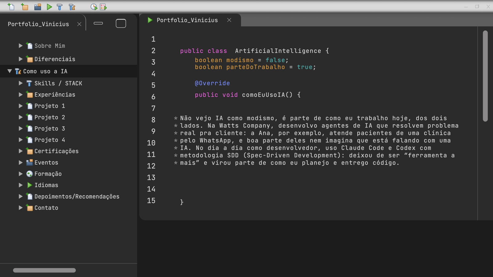
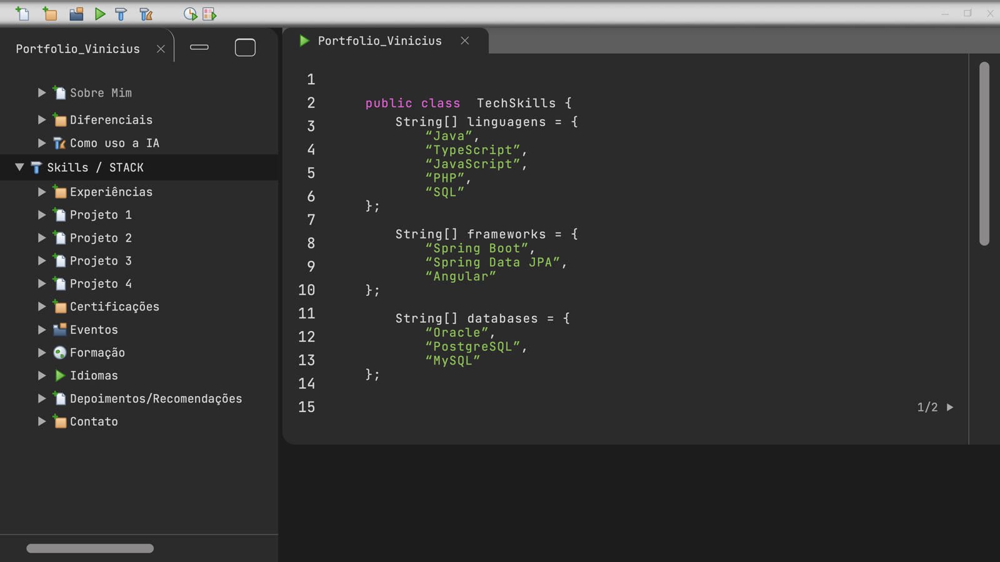
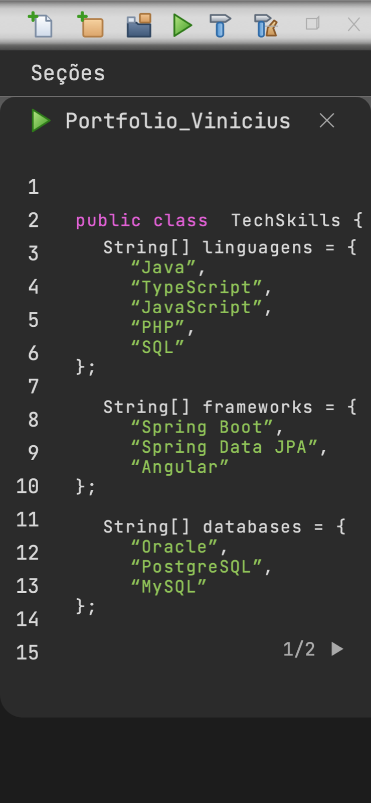

# 0004: Seções Como uso a IA e Skills

- **Data:** 2026-10-09
- **Change:** [secoes-como-uso-ia-e-skills](../../openspec/changes/secoes-como-uso-ia-e-skills/)
- **PR:** a definir
- **ADRs:** nenhum (a change não tomou decisão nova de arquitetura, ferramenta ou processo)

## Problema

As rotas `/como-uso-ia` e `/skills` ainda mostravam o aviso de "em construção". O conteúdo era
simples, mas a seção Skills trouxe um problema novo: ela ocupa **duas telas** do design (05 e 06),
e até então cada seção era uma tela só. Eu precisava de um jeito de navegar entre as telas de uma
mesma seção que servisse também para as próximas seções com várias telas.

## Decisões

- **Skills em páginas com endereço próprio.** Havia três opções: páginas com endereço próprio,
  uma única página rolando e troca automática. O Vinicius escolheu as páginas: `/skills` e
  `/skills/2`, pré-renderizadas, com um controle `1/2` acessível. Descartei a rota com parâmetro
  (`:pagina`), porque a pré-renderização exigiria listar os parâmetros e validar o número; rotas
  estáticas já são pré-renderizadas, e qualquer outra página cai no `**` e volta ao Início.
- **Um mecanismo reutilizável.** A lista de seções ganhou o campo opcional `paginas`. As rotas, o
  título (`(X/N)` a partir da página 2) e o controle saem dele. Experiências, Certificações e
  Níveis de conhecimento vão reutilizar o mesmo caminho: basta declarar `paginas`.
- **Fidelidade com bom senso.** A tela 04 grafa a classe `ArtificialItenligence`. A regra do
  projeto é seguir o design, mas o Vinicius decidiu corrigir para `ArtificialIntelligence`, para
  não parecer erro de digitação. É a única exceção na seção e está comentada no código.
- **Uma densidade só.** As listas de Skills são ainda mais apertadas que os campos de
  Diferenciais. O editor ganhou a densidade `apertada`, e as variações foram unificadas no campo
  `densidade` das linhas (`compacta` ou `apertada`), com construtoras de atalho.

## Aprendizado

- **Um glifo que a fonte não tem.** O controle de páginas usava os caracteres `◂` e `▸`, que não
  existem na JetBrains Mono. O navegador caía numa fonte reserva, e as setas saíam minúsculas.
  Troquei por SVG, que também fica igual em qualquer sistema.
- **Unificar antes de multiplicar.** A densidade apertada começou como mais um campo ao lado da
  linha compacta. Na revisão, antes de virarem três variações soltas, elas viraram um campo
  `densidade`. O custo da mudança foi pequeno porque aconteceu cedo.
- **Testes que acompanham a lista.** Os testes de rotas e a lista de rotas do axe passaram a ser
  gerados da lista de seções. Uma seção nova, ou uma página nova, entra nos testes sem editar
  nenhum deles.
- **Acessibilidade desde o início.** O controle de páginas é uma `nav` com rótulo, links com nome
  ("Página anterior", "Próxima página") e o número lido como "página X de N". O axe continua sem
  violações.
- **Os números da change.** 225 testes unitários (99,1% das linhas), 124 E2E, 17 rotas
  pré-renderizadas e o axe sem violações.

## Links

- Change: [`openspec/changes/secoes-como-uso-ia-e-skills`](../../openspec/changes/secoes-como-uso-ia-e-skills/)
- Documentação: [componentes](../componentes.md), com `PaginasDaSecao`, a densidade das linhas e
  como criar uma seção com várias páginas
- Entrada anterior: [0003 seções Sobre Mim e Diferenciais](0003-secoes-sobre-mim-e-diferenciais.md)

## Rascunho de post para o LinkedIn

> Uma seção do meu portfólio ocupa duas telas do design. Como você navega entre elas?
>
> Skills tem as telas 05 e 06. Até então, cada seção era uma tela só. Eu tinha três caminhos:
> páginas com endereço próprio, uma página rolando ou troca automática. Escolhi páginas:
> `/skills` e `/skills/2`, pré-renderizadas, com um controle `1/2` que leitores de tela entendem.
>
> O melhor é que virou um mecanismo. Para uma seção ter várias páginas, basta declarar quantas
> são. As rotas, o título e os testes saem da mesma lista. As próximas seções com várias telas já
> têm o caminho pronto.
>
> Duas lições pequenas no caminho:
>
> - As setas do controle eram caracteres que a fonte do site não tem, e o navegador usava uma
>   fonte reserva minúscula. Troquei por SVG.
> - O design grafa "ArtificialItenligence". Eu sigo o design à risca, mas aqui corrigi para
>   "ArtificialIntelligence": fidelidade também precisa de bom senso.
>
> A change fechou com 225 testes unitários, 124 E2E, 17 rotas pré-renderizadas e o axe sem
> violações.
>
> Quando o design não cobre um caso (como navegar entre telas), como você decide o que construir?
>
> #Angular #Acessibilidade #DesenvolvimentoDeSoftware
