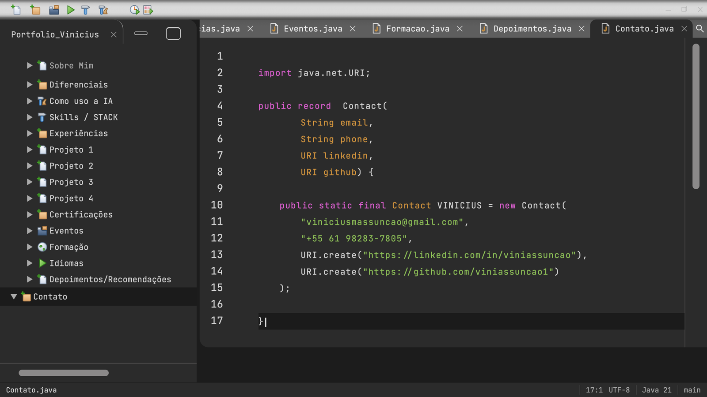
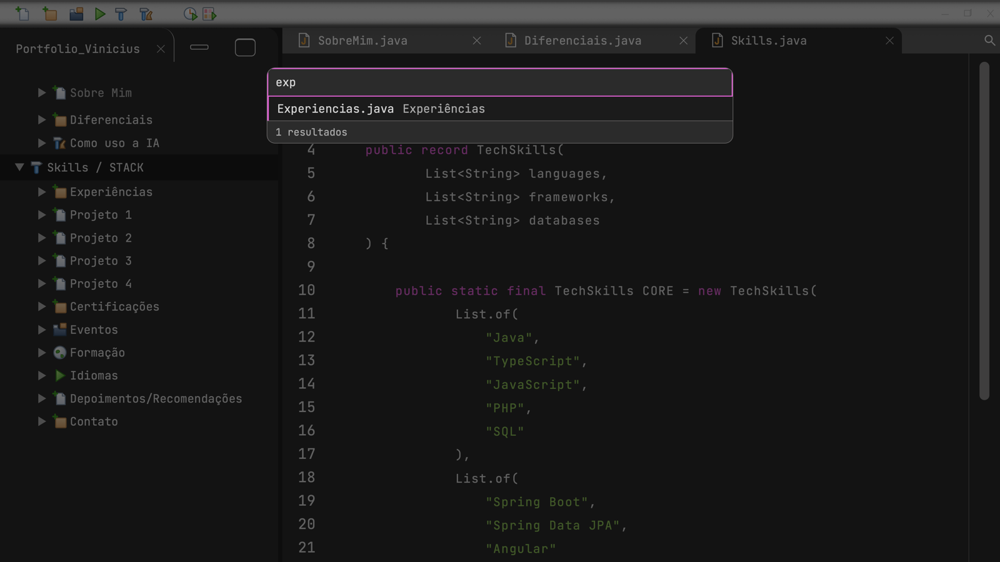
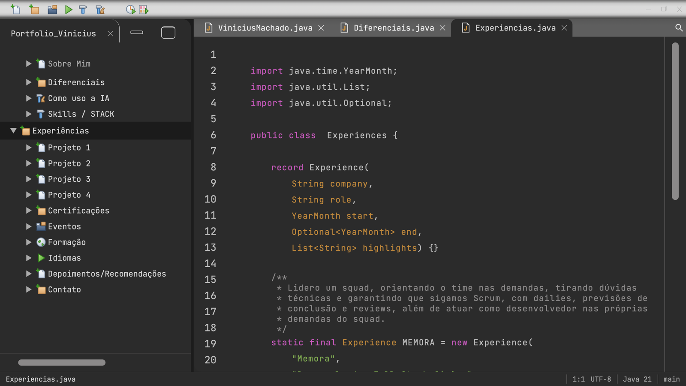
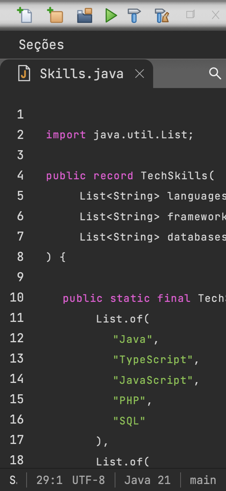

# 0005: Experiência de IDE e Java moderno

- **Data:** 2026-10-09
- **Change:** [experiencia-de-ide-e-java-moderno](../../openspec/changes/archive/2026-10-09-experiencia-de-ide-e-java-moderno/)
- **PR:** [#16](https://github.com/viniassuncao1/Portifolio-Vinicius-Machado/pull/16)
- **ADRs:** [0010](../adr/0010-design-como-referencia-e-java-moderno.md)

## Problema

Até aqui o site era uma imagem de IDE: a faixa de abas era decorativa, não havia barra de status,
busca, digitação nem cursor. E o código exibido seguia o design à risca, inclusive onde não era
Java válido (uma classe sem a chave de fechamento, arrays `String[]`, nomes em português). Num
portfólio que também prova o que eu sei, isso pesava. Faltavam ainda várias seções de conteúdo que
já cabiam no mecanismo existente.

## Decisões

- **O design passa de especificação a referência.** Foi uma mudança de direção minha, registrada no
  [ADR-0010](../adr/0010-design-como-referencia-e-java-moderno.md): o design mantém a identidade
  visual (cores, tipografia, proporções e estrutura de IDE), e o site ganha o comportamento de uma
  IDE de verdade. Descartei manter a fidelidade estrita e também aplicar Java moderno só nas seções
  novas, que deixaria dois estilos de código lado a lado.
- **Java 21 moderno, preservando as informações.** `record`, `List.of`, `YearMonth`, `Optional`,
  Javadoc, identificadores em inglês e textos em pt-BR. As cinco seções já publicadas foram
  reescritas, e as exceções antigas (a chave que faltava, a grafia corrigida por exceção) viraram
  a regra.
- **Experiência de IDE.** Abas por arquivo `.java` (alternar e fechar), digitação do código com
  cursor e linha atual, barra de status e busca de seções com Ctrl/Cmd+P. A digitação é só visual:
  o texto completo fica sempre no DOM, e com movimento reduzido o código aparece pronto.
- **Seções novas.** Experiências (3 páginas), Eventos, Formação, Idiomas e Contato, com links reais
  de e-mail, telefone, LinkedIn e GitHub.
- **A equipe cresceu de 4 para 6 especialistas.** Grafite e Nanquim, com o papel Seções, escrevem
  o conteúdo em Java moderno. A change foi dividida em **trilhas paralelas por arquivos**: a Base
  (Pincel) primeiro; depois abas, status e busca (Pincel), digitação e cursor (Compasso), seções
  publicadas (Grafite) e seções novas (Nanquim), com testes (Sentinela) e docs (Escriba)
  acompanhando.

## Aprendizado

- **Trilhas por arquivos funcionam, com regras.** Seis agentes na mesma cópia do repositório só
  deram certo porque cada trilha tinha arquivos próprios e a Base veio antes. Um commit chegou a
  levar arquivo de outra trilha, e a regra ficou: `git add` só dos próprios arquivos, nunca
  `-A` ou `.`.
- **Agentes travam em pergunta de permissão.** Abrir capturas fora do projeto parava o agente
  esperando confirmação. A regra agora é copiar as capturas para `.maestri/capturas/` antes de
  abrir.
- **Os testes pegaram o que a revisão visual não pegou.**
  - O axe acusou botões de fechar dentro do `tablist` das abas (`aria-required-children`, crítico,
    em todas as rotas). Os botões foram para fora do `tablist`, sobre a ponta de cada aba.
  - O cursor continuava piscando com movimento reduzido, por causa da especificidade do CSS.
  - Ctrl+P com o foco no `body` abria a impressão do navegador em vez da busca.
  - Delete numa aba levava o foco para a aba errada.
  - A busca reabria com o texto da vez anterior.
- **O Javadoc precisou de uma construtora própria.** Para alinhar os `*` sob o `/**` sem quebrar o
  Java, o editor desenha a abertura, os asteriscos e o fechamento como elementos só visuais. O texto
  copiado e lido por leitores de tela é só o conteúdo.
- **Números finais.** 438 testes unitários (98,2% das linhas), 249 E2E, 19 rotas pré-renderizadas e
  o axe sem violações em desktop e celular.

## Links

- Change: [`openspec/changes/archive/2026-10-09-experiencia-de-ide-e-java-moderno`](../../openspec/changes/archive/2026-10-09-experiencia-de-ide-e-java-moderno/)
- ADR: [0010 design como referência e Java moderno](../adr/0010-design-como-referencia-e-java-moderno.md)
- Documentação: [componentes](../componentes.md), [arquitetura](../arquitetura.md) e
  [equipe de agentes](../equipe-de-agentes/README.md)
- Entrada anterior: [0004 seções Como uso a IA e Skills](0004-secoes-como-uso-ia-e-skills.md)

## Rascunho de post para o LinkedIn

> Mudei de ideia sobre o meu próprio portfólio: o design deixou de ser uma especificação e virou
> uma referência.
>
> Eu vinha copiando as telas à risca, até onde o código exibido não era Java válido. Mas o site
> também é a prova do que eu sei. Então decidi duas coisas: o site precisa se comportar como uma
> IDE de verdade (abas, digitação, cursor, barra de status, busca com Ctrl+P) e o código precisa ser
> Java 21 moderno, com record, List.of, YearMonth, Optional e Javadoc, sem perder nenhuma
> informação.
>
> Para fazer isso em paralelo, a equipe de agentes de IA passou de 4 para 6 especialistas, cada um
> com arquivos só seus. Deu certo, com regras que aprendi na prática: cada agente dá git add só dos
> próprios arquivos, e capturas de tela vão para uma pasta do projeto, senão o agente trava
> esperando permissão.
>
> Os testes automáticos pegaram bugs que eu não veria: botões de fechar mal posicionados na
> hierarquia de acessibilidade, um cursor que piscava mesmo com movimento reduzido e um Ctrl+P que
> abria a impressão do navegador.
>
> A change fechou com 438 testes unitários, 249 E2E e o axe sem violações em desktop e celular.
>
> Você segue o design ao pé da letra ou o trata como referência?
>
> #Angular #Java #IA
