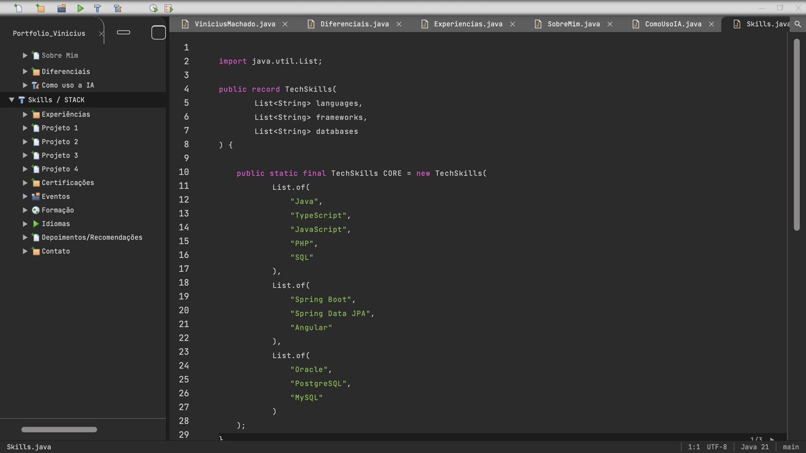
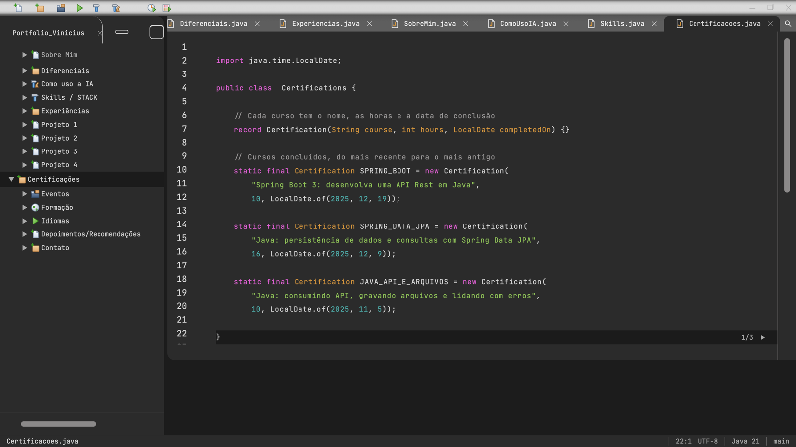
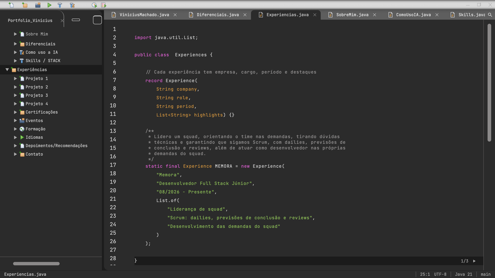

# 0006: Certificações, níveis de conhecimento e legibilidade

- **Data:** 2026-10-09
- **Change:** [certificacoes-niveis-e-legibilidade](../../openspec/changes/certificacoes-niveis-e-legibilidade/)
- **PR:** [#17](https://github.com/viniassuncao1/Portifolio-Vinicius-Machado/pull/17)
- **ADRs:** nenhum novo. A change segue o [ADR-0010](../adr/0010-design-como-referencia-e-java-moderno.md).

## Problema

Olhei o site no ar e ele estava **gigantesco e técnico demais para recrutadores**. O código saía
em 23px, cabiam cerca de 15 linhas no editor, e o Java mostrava `Optional<YearMonth>`,
`URI.create` e genéricos aninhados que não ajudam quem só quer saber o que eu fiz. Faltavam
também as certificações e os níveis de conhecimento das tecnologias.

## Decisões

- **Escala só por tokens.** Os tamanhos de `src/styles/_tokens.scss` caíram de 23px para ~17px
  (`--texto-codigo` em 1,06rem). Árvore, abas e barra de status ficaram em ~16px, e o celular
  ganhou uma escala própria. Nenhum componente foi tocado, as cores não mudaram, e agora cabem
  **28 linhas** no editor (antes, ~15).
- **Java que qualquer pessoa entende.** Nomes que se explicam, um comentário `//` em pt-BR por
  bloco, listas de até 5 tecnologias numa linha e Javadoc só para parágrafos. `Optional<YearMonth>`
  virou o texto `"08/2026 - Presente"`, e o `URI.create` saiu do Contato. Os identificadores
  continuam em inglês, com comentários em pt-BR (`// Inglês`, em Idiomas). O guia está em
  [componentes](../componentes.md#guia-de-legibilidade).
- **Níveis de conhecimento em Skills.** No design eles ficavam em Formação. Movi para a página 3
  de Skills, porque falam da stack, não da minha formação. Descartei manter a posição do design:
  o ADR-0010 permite desvios que melhorem a experiência.
- **Certificações.** Uma seção nova com os 9 cursos em 3 páginas.
- **Barra de status com a linha visual.** O Javadoc ocupa várias linhas na tela, e a barra passou
  a mostrar a linha que se vê, não a do arquivo.

## Aprendizado

- **Olhar o site no ar vale mais que a revisão de código.** Os testes e o axe estavam verdes, e
  mesmo assim a escala estava errada para o público. A correção veio de uma frase minha ao ver a
  página, não de uma ferramenta.
- **Tokens pagam a conta.** Como todo tamanho vinha de um arquivo, mudar a escala inteira foi
  trocar valores, sem tocar nos componentes.
- **Simplificar não é perder o Java.** `record`, `List.of` e `java.time` ficaram. Saiu só o que
  não ajudava o leitor.
- **O `git add` amplo voltou a morder.** Um especialista levou junto o arquivo de outro. A lição
  é a mesma da entrada anterior: sempre o caminho exato.
- **O Mac dormindo interrompeu os agentes de novo.** Respostas foram cortadas no meio e a
  Escriba precisou ser reiniciada. Tarefas curtas e com estado nas notes ajudam a retomar.
- **Números finais.** 581 testes unitários e mais de 250 testes E2E.

## Links

- Change: [`openspec/changes/certificacoes-niveis-e-legibilidade`](../../openspec/changes/certificacoes-niveis-e-legibilidade/)
- Documentação: [componentes](../componentes.md)
- Entrada anterior: [0005 experiência de IDE e Java moderno](0005-experiencia-de-ide-e-java-moderno.md)

## Rascunho de post para o LinkedIn

> Abri o meu portfólio no ar e pensei: está grande demais e técnico demais para quem vai ler.
>
> Os testes passavam, o axe não acusava nada, mas o código saía em 23px, cabiam 15 linhas na tela
> e o Java mostrava coisas como Optional<YearMonth> e URI.create. Para um recrutador, isso é
> ruído.
>
> Corrigi em duas frentes. A escala caiu de 23px para ~17px mudando só os tokens de design, sem
> tocar nos componentes: agora cabem 28 linhas no editor. E o Java virou "Java que qualquer pessoa
> entende": nomes que se explicam, um comentário em português por bloco e o período escrito como
> texto, "08/2026 - Presente". Mantive record, List.of e java.time.
>
> Aproveitei para mover os níveis de conhecimento para Skills, porque falam da stack, e para
> publicar as 9 certificações em 3 páginas.
>
> Dois tropeços do processo: um git add amplo de um agente levou o arquivo de outro, e o Mac
> dormindo interrompeu os agentes no meio da tarefa.
>
> A change fechou com 581 testes unitários e mais de 250 testes E2E.
>
> Quando foi a última vez que você olhou o seu projeto com os olhos de quem vai avaliá-lo?
>
> #Angular #Java #IA
